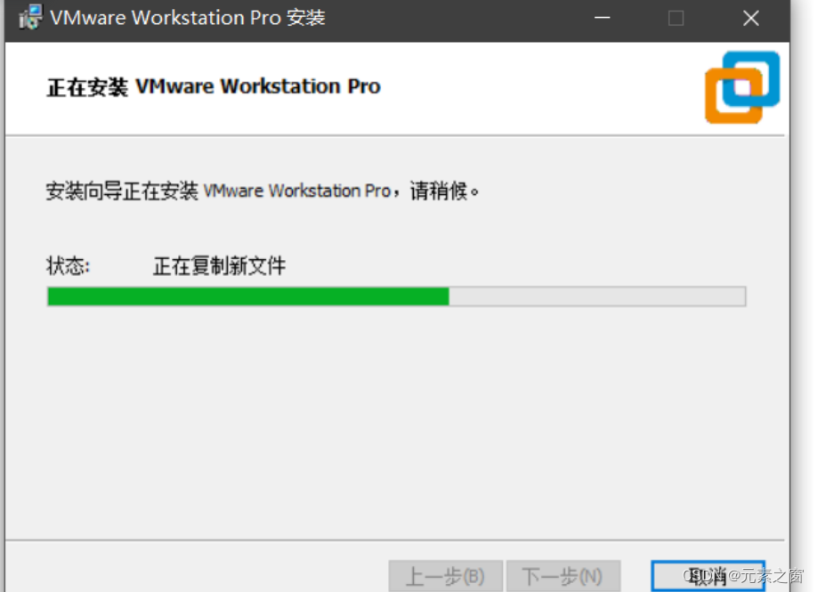
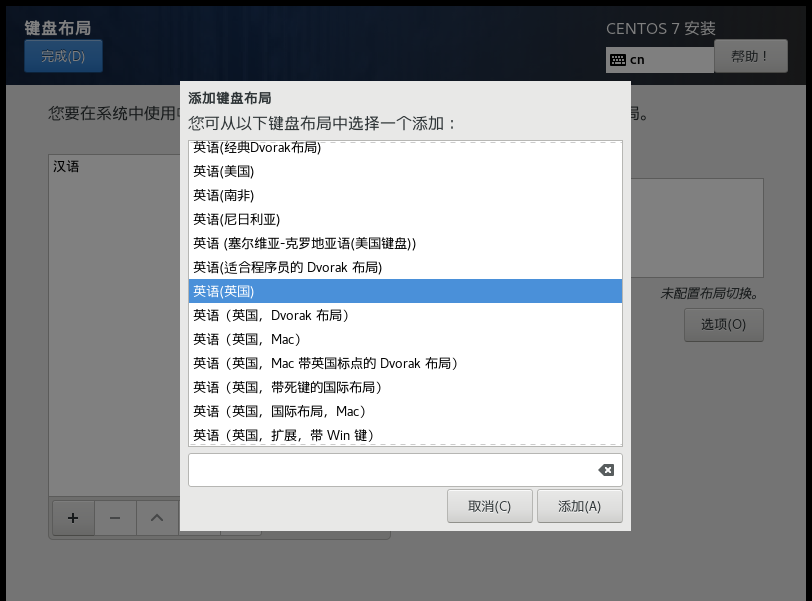
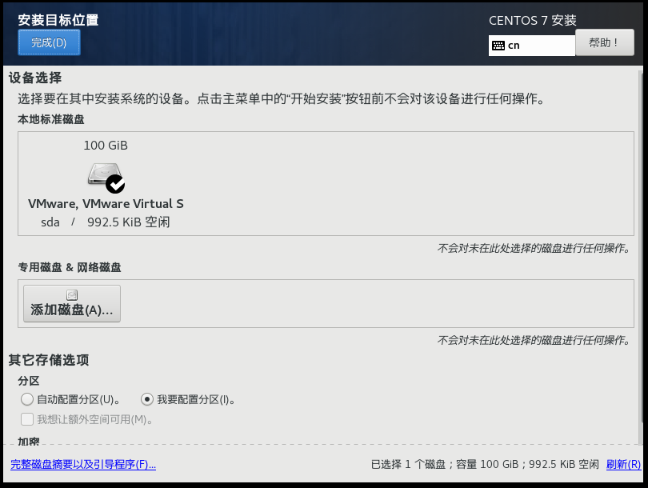
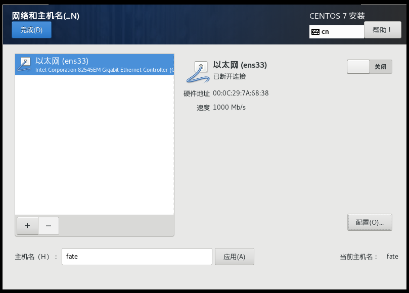

## 前言

在本篇文章中，我将根据自己所学内容，总结从VM虚拟机安装到使用docker部署单机版fate的教程，如果有什么不清楚或者讲错的地方，请大家留言指出

### 环境需求

1.一台可以访问外网的设备（服务器或自己的电脑均可）。

2.100GB以上的硬盘空间，如果硬盘比较小可能后续安装成功了也无法跑项目。

## Getting Started 开始

如果有能力的话可以看github上fate官方的单机版部署教程，会比较简洁。

[FATE/deploy/standalone-deploy 在 v1.11.0 ·联邦人工智能/命运 --- FATE/deploy/standalone-deploy at v1.11.0 · FederatedAI/FATE (github.com)](https://github.com/FederatedAI/FATE/tree/v1.11.0/deploy/standalone-deploy)

接下来我们正式开始部署教程

### 安装vmware虚拟机

1.VMware虚拟机下载网址：[下载 VMware Workstation Pro | CN](https://www.vmware.com/content/vmware/vmware-published-sites/cn/products/workstation-pro/workstation-pro-evaluation.html.html.html)

2.下滑到这个为止，下载Workstation 17Pro for Windows这个。

3.下载成功后会有一个exe文件，直接运行进行安装

    

4.勾选这两个选项

    

5.安装完成后选择许可证选项

    

    

6.输入许可证，可使用自己找的，也可以输这个：JU090-6039P-08409-8J0QH-2YR7F

    

7.输入完成后软件可能会要求重启系统，重启系统后进入软件，没有弹许可证提示并且可以看到这个界面就是安装完成了。

    

### 新建虚拟机

安装完成Vm软件以后，我们需要新建一个虚拟机用来搭载我们的fate框架，在这个步骤中我们需要先下载一个centos或者Ubuntu，由于实验室之前用的都是centos驱动，所以这里的演示操作我们也以centos为例，ubuntu的部署流程类似，可以自己试着做做看。

1.下载centos驱动

centos的驱动可以从国外官网或者国内镜像进行下载，也可以问实验室的学长直接要一个，这里我们用国内镜像源进行下载，下载完成后需要记住下载的位置，后面用得到。

[Index of /centos-vault/7.9.2009/isos/x86_64/ | 清华大学开源软件镜像站 | Tsinghua Open Source Mirror](https://mirrors.tuna.tsinghua.edu.cn/centos-vault/7.9.2009/isos/x86_64/)

想下载centos7的同学用上面这个网址就可以了，centos8可以在清华源阿里源都可以找，比较方便就不多说明了,一般下dvd版本的就可以了，如果下载boot版本的话只包含基本启动引导的文件，需要联网下载其他内容，在网络不好的情况下不建议使用。

    

我下载的是这个版本

    

2.开始创建自己的虚拟机

点击创建新的虚拟机，会弹出一个新建向导，新手开始使用时建议选择典型就可以了，需要配置的参数比较少，更方便一些。点击下一步。

    

选择稍后安装操作系统，点击下一步.

    

客户机操作系统选择Linux，版本要与之前下载的centos版本相匹配，如果你下的是7就选7，下的是8就选8。安装Ubuntu的同学可以选Ubuntu的版本。选择完成后点击下一步。

    

为自己的虚拟机取一个名字，并选择安装的位置，完成后点击下一步

    

将最大的磁盘大小调的尽可能大一些，后续做fate的学习的时候如果磁盘太小了会跑不起来。

选择将虚拟磁盘拆分为多个文件（M），后面如果要移动虚拟机的位置这样不会报错。

两个操作都完成后点击下一步。

    

完成这一步后我们会见到这样的一个虚拟机创建向导界面，我们需要自定义一些硬件条件。

    

点开自定义硬件

内存设置为4或者8，不然会比较卡，具体可以根据自己的电脑配置做调整。

    

处理器数量为1，处理器内核我设置的是4个，具体数量可以根据自己电脑配置做调整。如果后面想做fate集群部署的话我们需要将内核数调整为8个或者16个，不然安装的时候会报错。

    

接下来配置cd驱动文件，点击新CD/DVD(IDE)，连接选择使用ISO映像文件，将之前下载的centos的dvd文件路径放入这个位置。

    

剩下的四个选项初学者一般不做调整，网络适配器默认NAT，显示器用主机设定即可，点击关闭后可以在向导界面看到刚刚我们做的配置。

    

点击完成，可以看到我们的虚拟机列表里多了一个刚刚创建的虚拟机，选中并点击开启此虚拟机。虚

    

中途有一个选项直接回车就行，可以看到虚拟机正在启动，等待完成。

    

完成后会跳转到这样的一个初始化配置界面，我们将左边的这个选项条拖到最下面，选择简体中文，选择好以后点击continue。

    

会进入到这样一个引导界面，选择键盘进行添加，选择英语（英国）进行添加，添加好后点击完成。

    

    

    

点击软件选择，选择带GUI的服务器，这样的话安装完以后会有一个图形控制界面，方便初学者的使用，如果之前有使用过Linux系统的经验的同学可以选择最小安装，这样的话就只有命令行模式。

    

接下来是存储空间的配置

在左下角的位置选择我要配置分区，点击完成

会进入到手动分区的位置，先点击蓝色的点这里自动创建他们（c）

自动创建完成后，我会习惯将根目录的空间调大一些，你们可以参照我的截图中空间的分配进行分配。

点击完成，点击接受更改。

    

    

    

接下来是修改网络与主机名，

先将以太网旁边的滑块按钮选择打开

再修改主机名，根据自己的需求进行修改，这里我改的是fate

点击应用，全部操作完成后可以看到引导界面变成我现在这个样子，当前主机名为你修改后的名字。

    

点击完成，到此你已经完成了虚拟机的所有配置，点击开始安装，安装属于你自己的虚拟机。

在安装过程中可以看到这样的两个选项，先点击root密码。

    

设置自己的root密码，这边建议设置比较短的密码，以后经常要用的。密码过短需要连续点击两次完成才可以通过。

记住这个密码，后面用到和管理员权限有关的很多操作都需要用到这个密码，所以一定要记住。

    

接下来开始创建自己的用户，这些信息都自行输入即可，这个是用于虚拟机初始界面的登录。

    

点击重启

    

同意licensing，到此就完成了虚拟机的部署。

    

