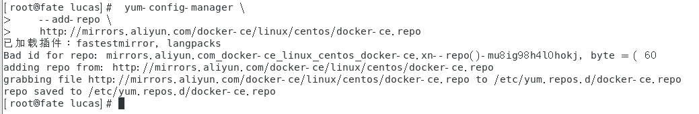
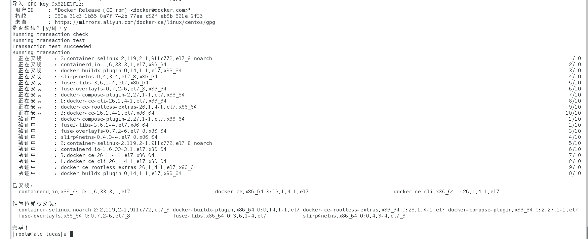
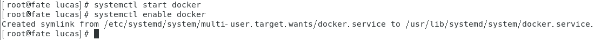
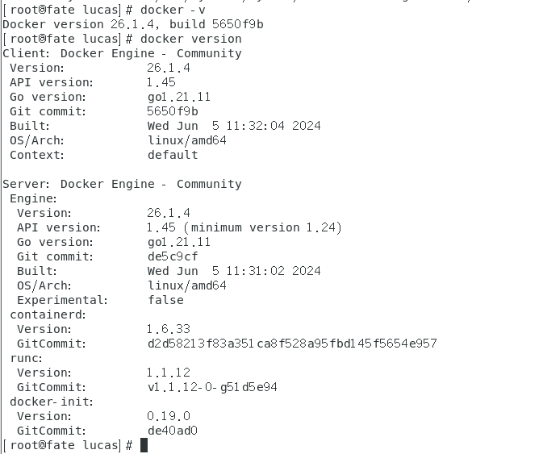
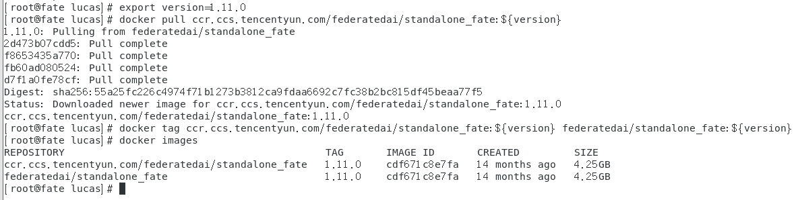
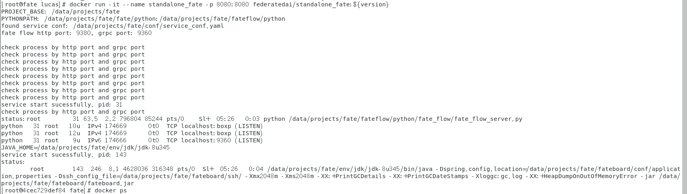
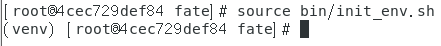

## fate部署教程（docker安装和fate镜像拉取以及启动教程）

在阅读这篇教程前，请各位同学先完成VMware虚拟机的配置，开一台属于自己的虚拟机。

学习是一个需要不断试错的过程，建议各位同学先自行尝试fate的安装，如果自己能力有限还是无法完成，再来查看本文。

### centos7安装docker

不同版本的centos的docker的安装都可以在网上找到教程，本文以centos7为例。

** 安装docker前需要确保你的虚拟机可以联网，可以打开浏览器看看自己的虚拟机能不能联网。如果不能联网的话先配置网卡让自己的虚拟机可以正常上网。

网上有很多让虚拟机联网的方法，使用nat模式和桥接模式均可。

##### 1.查看内核版本

注意docker的安装需要大家先查看自己的内核版本高于3.10，所以需要大家先验证自己的版本是否适合安装docker。

通过 uname -r 来查看自己的内核版本。

[root@fate lucas]#  uname -r

##### 2.确保自己的yum版本是最新版

yum -y updata

这一步不是必须的，看个人的情况，但是如果后面出现了版本不兼容的情况就需要重新回来updata了

##### 3.更新完成后安装需要的软件包，yum-util 提供yum-config-manager功能，另外两个是devicemapper驱动依赖的。

yum install -y yum-utils device-mapper-persistent-data lvm2

    

##### 4.设置yum源

使用官方源地址（比较慢）
[root@localhost ~]#  yum-config-manager \
    --add-repo \
    http://mirrors.aliyun.com/docker-ce/linux/centos/docker-ce.repo

也可以用国内的一些源地址
阿里云
[root@localhost ~]# yum-config-manager \
    --add-repo \
    http://mirrors.aliyun.com/docker-ce/linux/centos/docker-ce.repo

清华大学源
[root@localhost ~]# yum-config-manager \
    --add-repo \
    https://mirrors.tuna.tsinghua.edu.cn/docker-ce/linux/centos/docker-ce.repo

    

##### 5.查看源仓库中所有docker的版本号

[root@fate lucas]#  yum list docker-ce --showduplicates | sort -r

    

##### 6.安装docker engine-community

###### 6.1 安装最新版本的docker

[root@localhost ~]# yum install docker-ce docker-ce-cli containerd.io    #  默认最新版

安装过程中会有[Y/N]的提示，直接选Y就行了

    

###### 6.2 安装指定版本的docker

具体安装命令参考官网，官网上有很详细的教程。

##### 7.启动docker并设置为开机自启动

[root@fate lucas]# systemctl start docker
[root@fate lucas]# systemctl enable docker

    

##### 8.查看是否安装成功

使用docker -v或者docker version查看自己的docker版本号，能显示就是成功了。

    

## 至此你已经完成了docker的安装，接下来我们要开始学习拉取fate框架的docker镜像。

docker镜像类似于一个别人已经为你打包好的容器，你可以直接从网上把他拉取过来使用，不需要过多的配置，因此使用docker来部署学习单机版fate不容易出现错误。

[FATE/deploy/standalone-deploy at v1.11.0 · FederatedAI/FATE (github.com)](https://github.com/FederatedAI/FATE/tree/v1.11.0/deploy/standalone-deploy)

大家在阅读这篇文章前，可以试着先根据官网的部署教程试试看，如果刚接触这方面的知识没法根据官网教程完成部署，那么再来看我这篇文章会比较有帮助。

#### 1.部署前环境检查

·首先要确保主机可以访问外部网络，因为我们需要从公网中拉取dokcer的安装镜像

·docker的版本官方建议18.09，可以使用docker --version来查看版本，如果不匹配可以选择卸载重装指定版本，也可以用当前版本尝试一下，但是出了问题就从头再来一遍，不要害怕重来，学习是一个不断试错的过程。

·检查8080端口是否被占用，这个端口后续要用来部署fate的可视化工具，所以这一点还是比较重要的。如果被占用就要停用端口的占用或者卸载占用此端口的docker。

#### 2.版本设置

设置需要部署的fate版本号

export version = {本次需要部署的版本号，我以1.11.0为例}

export verison=1.11.0

注意这里的1.11.0前面不能有空格

#### 3.拉取镜像文件

这里提供了三种方法，如果在实验室的同学建议使用第一种方法比较好

#1.腾讯云容器镜像

docker pull ccr.ccs.tencentyun.com/federatedai/standalone_fate:${version}
docker tag ccr.ccs.tencentyun.com/federatedai/standalone_fate:${version} federatedai/standalone_fate:${version}

#2.docker hub

docker pull federatedai/standalone_fate:${version}

#3.通过镜像包安装

wget https://webank-ai-1251170195.cos.ap-guangzhou.myqcloud.com/fate/${version}/release/standalone_fate_docker_image_${version}_release.tar.gz
docker load -i standalone_fate_docker_image_${version}_release.tar.gz
docker images | grep federatedai/standalone_fate

拉取完成后如果可以看到对应的${version}的镜像就下载成功了。

可以用docker images来查看自己的docker已经拉取的镜像文件

    

#### 4.启动

docker run -it --name standalone_fate -p 8080:8080 federatedai/standalone_fate:${version}

启动完成后可以看到自己已经进入到fate容器中，lucas变成了fate

    

#### 5.测试

首先进入环境，未来所有fate的操作都需要在环境内执行，所以要记住这条指定

source bin/init_env.sh

    

##### 5.1 Toy测试

flow test toy -gid 10000 -hid 10000

如果成功会出现下方的语句

success to calculate secure_sum, it is 2000.0

最后的数字可能是1999.9999也有可能是2000

##### 5.2 单元测试

fate_test unittest federatedml --yes

如果成功会出现下方的语句

there are 0 failed test

测试通过后就完成了单机版fate的所有部署操作。

如果还有问题可以与实验室的学长咨询，或到咸鱼平台上搜索“fate联邦学习”找到Lucas。[doge]
